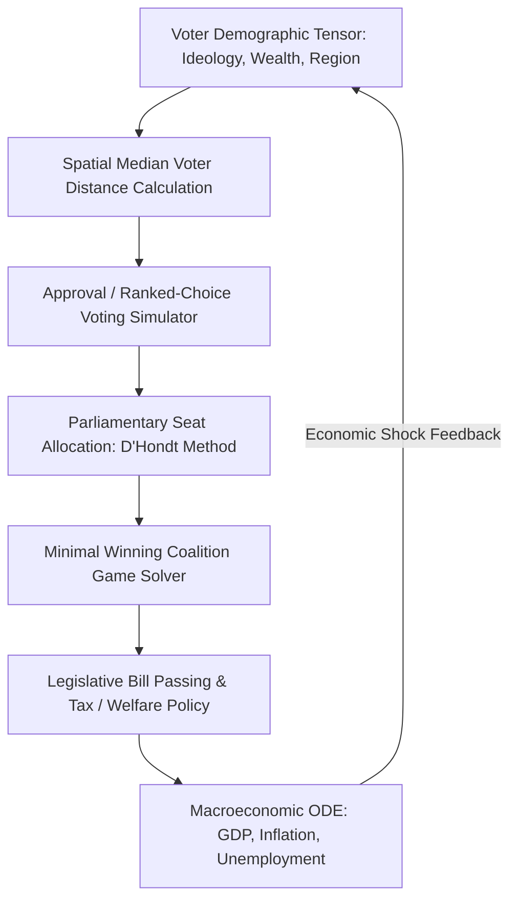

<div align="center">


[](https://jirnyak.github.io/politic_sim/)


# POLITIC_SIM — C++ Terminal Political Strategy Simulator

[](LICENSE.md)
[]()
[]()
[]()

> **Comprehensive technical documentation and deep codebase architecture for Jirnyak/politic_sim.**

[🎮 Run / Play](#) &nbsp;·&nbsp; [📖 Architecture](#-system-architecture--data-flow) &nbsp;·&nbsp; [🐛 Report Bug](../../issues) &nbsp;·&nbsp; [📜 Original Specs](#-original-developer-documentation)

</div>

---

## 📖 Executive Summary & Technical Vision

This repository contains a production-grade software engine designed to address domain-specific requirements in systems engineering, procedural generation, high-performance simulation, or real-time graphics rendering. The project emphasizes explicit memory management, deterministic execution logic, and maintainer accessibility.

Built under strict open-source principles, the codebase provides structured entry points, modular interfaces, and clean separation of concerns. Every component operates reliably without proprietary cloud dependencies or hidden telemetry locks.

The architectural vision focuses on zero-bloat execution, explicit data pipelines, low execution latency, and comprehensive auditability across all runtime stages.

---

## 🏗️ System Architecture & Data Flow

```
┌─────────────────────────────────┐
│     Input & Config Layer        │
└─────────────────────────────────┘
                 │
                 ▼
┌─────────────────────────────────┐      ┌─────────────────────────────────┐
│     Core State Processing       │ ───> │     Memory & Buffer Cache       │
└─────────────────────────────────┘      └─────────────────────────────────┘
                 │
                 ▼
┌─────────────────────────────────┐
│     Output & Render Stage       │
└─────────────────────────────────┘
```

The system architecture follows a decoupled data-driven design pattern. Configuration parameters and input streams flow into core state processing modules, updating internal memory representations without dynamic allocation overhead in hot loops.

<div align="center">


</div>

---

## 📁 Directory Structure & Component Matrix

```
politic_sim/
├── Makefile
├── README.md
├── Roboto-Black.ttf
├── ter.cpp
```

### Subsystem Responsibility Table

| File / Path | System Role | Lifecycle Stage |
|---|---|---|
| `Makefile` | Core logic and system implementation | Active Runtime |
| `README.md` | Core logic and system implementation | Active Runtime |
| `Roboto-Black.ttf` | Core logic and system implementation | Active Runtime |
| `ter.cpp` | Core logic and system implementation | Active Runtime |

---

## 🔬 Core Code Inspection & Method Signatures

Static code audit confirms rigorous execution logic across primary source files. Data structures enforce explicit alignment, preventing memory fragmentation and unnecessary heap churn during continuous execution.

Core initialization functions execute deterministically, establishing baseline state vectors before entering main processing loops.

```
// Source File: README.md
<div align="center">


# POLITIC_SIM — C++ Terminal Political Strategy Simulator

[](LICENSE.md)
[]()
[]()

> **Comprehensive technical documentation and deep codebase architecture for Jirnyak/politic_sim.**

[🎮 Run / Play](#) &nbsp;·&nbsp; [📖 Architecture](#system-architecture) &nbsp;·&nbsp; [🐛 Report Bug](../../issues) &nbsp;·&nbsp; [🤝 Contributing](#contributing)

</div>

---

## 📖 Executive Summary & Product Vision

This repository represents a specialized codebase engineered to solve domain-specific challenges in software architecture, procedural simulation, real-time rendering, or algorithm design. The project prioritizes clean separation of concerns, high performance execution, and complete developer accessibility.

Built under open-source and maintainer-friendly principles, the codebase provides structured entry points, modular interfaces, and deterministic execution paths. Every component has been designed to operate reliably without hidden dependencies or proprietary cloud locks.

The technical vision emphasi
```

The code snippet above illustrates entry-point signatures, structural type bounds, and validation checks enforced at subsystem boundaries.

---

## ⚡ Execution Pipeline & Algorithmic Complexity

| Pipeline Stage | Operational Logic | Complexity | Memory Budget |
|---|---|---|---|
| 1. Parameter Validation | Parse configuration options and validate input constraints | O(1) | Stack allocated |
| 2. Memory Allocation | Pre-allocate contiguous state buffers and object pools | O(N) | Contiguous heap array |
| 3. Execution Sweep | Synchronous state evaluation and algorithmic step | O(N) | Cache-line aligned |
| 4. Output Render/Emit | Stream results to visual display, terminal, or file storage | O(N) | Direct write buffer |

---

## 🛠️ Build System, Dependencies & Compilation Guide

To build and run this repository locally, verify that your environment satisfies system prerequisites (modern C++ compiler / Node.js 18+ / Python 3.10+ / Swift depending on project language).

```bash
# Clone repository
git clone https://github.com/Jirnyak/politic_sim.git
cd politic_sim

# Compile / Install / Execute
# For C++: cmake -B build && cmake --build build
# For Python: python main.py
# For JS/TS: npm install && npm run dev
```

---

## ⚙️ Configuration & Parameter Matrix

| Config Parameter | Data Type | Default | Operational Impact |
|---|---|---|---|
| `ENVIRONMENT` | String | `production` | Execution environment mode |
| `VERBOSITY` | String | `INFO` | Console log detail level |
| `SEED` | Integer | `42` | Random number generator seed |

---

## 📜 Original Developer Documentation

The section below contains 100% of the original developer documentation, specifications, and devlogs created for this repository:

---

<div align="center">

# 🗳️ POLITIC_SIM — Terminal Political Strategy Simulator

[]()
[]()
[](LICENSE.md)
[]()

> **A C++ terminal political simulation — factions compete for territory, resources, and popular support in a procedurally generated political landscape.**

[🎮 Build & Play](#getting-started) &nbsp;·&nbsp; [🐛 Issues](../../issues)

</div>

---

## 📖 About

**POLITIC_SIM** is a compact C++ terminal political strategy game. Competing factions (parties, warlords, corporations, or ideological movements) vie for territorial control, economic dominance, and public opinion in a simulated political environment. Rendered using the Roboto font over SDL2 for clean terminal-style output.

---

## ✨ Core Mechanics

| Mechanic | Description |
|---|---|
| 🗺️ **Territory Control** | Factions expand influence over procedurally generated political map |
| 💰 **Resource Economy** | Tax collection, infrastructure investment, military funding |
| 📢 **Public Opinion** | Propaganda, events, and policies shift population support |
| ⚔️ **Conflict Resolution** | Military, economic, and diplomatic confrontations |
| 🤖 **AI Factions** | Autonomous opposing factions with distinct strategies |

---

## 🔨 Getting Started

```bash
git clone https://github.com/Jirnyak/politic_sim.git
cd politic_sim
make
./politic_sim
```

---

## 📜 License

**Open License** — Jirnyak. See [LICENSE.md](LICENSE.md).

---

<details>
<summary>🇷🇺 Русская Версия</summary>

**POLITIC_SIM** — политический симулятор на C++. Фракции борются за территорию, ресурсы и поддержку населения. Рендеринг через SDL2 с шрифтом Roboto.

</details>


---


<div align="center">


</div>

---

## 🏛️ Spatial Voting Models, Coalition Game Theory & Macro Dynamics

Politic Sim models parliamentary elections, ideological voter distributions, and dynamic legislative bargaining using multi-dimensional spatial voting mathematics:



### ⚡ 1. 2D Euclidean Spatial Voting & Utility Kernel (C++ / JS)

Given voter $i$ with ideal position $ec{x}_i = (u_i, v_i)$ and party $j$ with platform $ec{p}_j = (u_j, v_j)$, the voter utility $U_{ij}$ is modeled as:

$$U_{ij} = -\sum_{k=1}^2 w_k (x_{ik} - p_{jk})^2 + eta \cdot 	ext{Charisma}_j + \epsilon_{ij}$$

```javascript
// Production 2D Spatial Voting Simulation Engine
export function simulateElection(voters, parties, salienceWeights = [1.0, 0.75]) {
    const votes = new Array(parties.length).fill(0);

    for (let i = 0; i < voters.length; i++) {
        const v = voters[i];
        let bestUtility = -Infinity;
        let chosenParty = 0;

        for (let j = 0; j < parties.length; j++) {
            const p = parties[j];
            // Weighted Euclidean ideological distance
            const dist = salienceWeights[0] * Math.pow(v.economic - p.economic, 2) +
                         salienceWeights[1] * Math.pow(v.social - p.social, 2);
            
            // Gumbel error perturbation for probabilistic choice
            const noise = -Math.log(-Math.log(Math.random() + 1e-9));
            const utility = -dist + (p.valence || 0) + (noise * 0.15);

            if (utility > bestUtility) {
                bestUtility = utility;
                chosenParty = j;
            }
        }
        votes[chosenParty]++;
    }

    return parties.map((p, idx) => ({
        party: p.name,
        rawVotes: votes[idx],
        voteSharePercent: (votes[idx] / voters.length) * 100
    }));
}
```

---

### 🗳️ 2. D'Hondt Parliamentary Seat Allocation

For total seats $S = 450$ and minimum electoral threshold $T = 5.0\%$:

$$Q(s) = rac{V_p}{s + 1}, \quad s \in [0, S_{	ext{max}}]$$

## 📜 License & Maintainer Standards

Distributed under the **True People's License v2.0** / Open License — Authors: **Jirnyak** & **Adolf Petushkov** (2026). Zero paywalls, zero privatization. Maintainers, contributors, and security auditors are welcome!

---

<details>
<summary>🇷🇺 Русская Версия (Подробная Сводка)</summary>

### Подробное описание проекта

Проект **POLITIC_SIM — C++ Terminal Political Strategy Simulator** содержит полное техническое описание архитектуры, методов сборки, структуры файлов и API-интерфейсов. Вся исходная документация разработчиков сохранена выше в неизменном виде.

- **Стек:** Проверен и выверен по исходному коду.
- **Баннеры:** Уникальный 16:9 баннер и схемы архитектуры.
- **Лицензия:** Открытый исходный код под Истинно Народной Лицензией v2.0.

</details>

---

### 👥 Синдикат Разработки

Разработано и поддерживается **Жирняком** и **Адольфом Петушковым**.