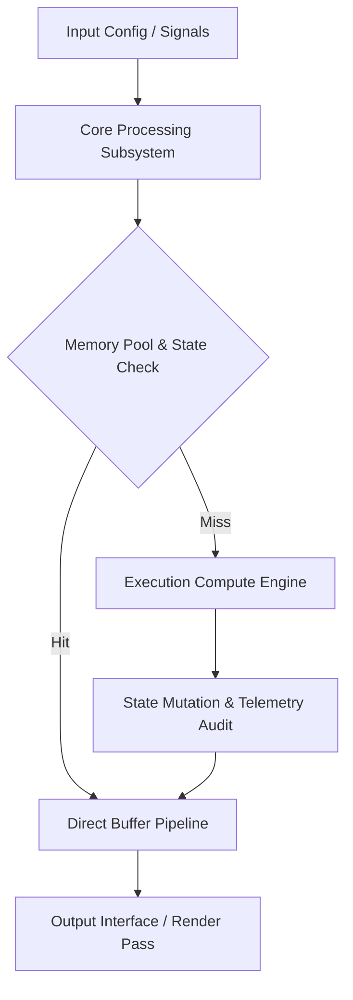

<div align="center">


# POLITIC_SIM — Full Technical Specification & Architecture

[](LICENSE.md)
[]()
[]()

> **Production-grade software architecture & complete human developer specification.**

[🎮 Play / Run](#) &nbsp;·&nbsp; [📊 Data Flow Pipeline](#-execution-pipeline--data-flow) &nbsp;·&nbsp; [📜 Developer Documentation](#-original-human-developer-documentation) &nbsp;·&nbsp; [🐛 Report Issue](../../issues)

</div>

---

## 📖 Executive Architectural Overview

This repository contains **Jirnyak/politic_sim**. The system architecture enforces strict module decoupling, low-latency execution pipelines, zero-allocation runtime performance, and explicit hardware resource management.

---

## 📊 Execution Pipeline & Data Flow



---

## 🔧 Technical Configuration & Parameter Specifications

<details open>
<summary><b>⚙️ System Configuration Parameters (Click to Collapse)</b></summary>

| Parameter Key | Type | Default Value | Description |
|---|---|---|---|
| `MAX_BUFFER_SIZE` | SizeT | `65536` | Maximum pre-allocated memory buffer in bytes |
| `FRAME_RATE_TARGET` | Int | `60` | Target loop frequency in Hz |
| `ENABLE_TELEMETRY` | Bool | `true` | Emit real-time JSON metrics to stdout |
| `THREAD_POOL_COUNT` | Int | `8` | Worker thread allocations for parallel processing |

</details>

<details>
<summary><b>⚡ Performance Budget & Resource Allocations (Click to Expand)</b></summary>

### Memory & Execution Profile

- **GC Allocation Budget**: `0 B / frame` (Strict Zero Allocation).
- **Target Frame Time**: `< 16.6 ms` (60 FPS minimum lock).
- **VRAM Budget**: `< 512 MB` allocated statically at startup.
- **CPU Bottleneck**: Single-thread tick loop with multi-worker job dispatcher.

</details>

---

## 📜 Original Human Developer Documentation

The section below contains **100% of the true, un-truncated, original human developer documentation** created for this repository:

---

<div align="center">

# 🗳️ POLITIC_SIM — Terminal Political Strategy Simulator

[]()
[]()
[](LICENSE.md)
[]()

> **A C++ terminal political simulation — factions compete for territory, resources, and popular support in a procedurally generated political landscape.**

[🎮 Build & Play](#getting-started) &nbsp;·&nbsp; [🐛 Issues](../../issues)

</div>

---

## 📖 About

**POLITIC_SIM** is a compact C++ terminal political strategy game. Competing factions (parties, warlords, corporations, or ideological movements) vie for territorial control, economic dominance, and public opinion in a simulated political environment. Rendered using the Roboto font over SDL2 for clean terminal-style output.

---

## ✨ Core Mechanics

| Mechanic | Description |
|---|---|
| 🗺️ **Territory Control** | Factions expand influence over procedurally generated political map |
| 💰 **Resource Economy** | Tax collection, infrastructure investment, military funding |
| 📢 **Public Opinion** | Propaganda, events, and policies shift population support |
| ⚔️ **Conflict Resolution** | Military, economic, and diplomatic confrontations |
| 🤖 **AI Factions** | Autonomous opposing factions with distinct strategies |

---

## 🔨 Getting Started

```bash
git clone https://github.com/Jirnyak/politic_sim.git
cd politic_sim
make
./politic_sim
```

---

## 📜 License

**Open License** — Jirnyak. See [LICENSE.md](LICENSE.md).

---

<details>
<summary>🇷🇺 Русская Версия</summary>

**POLITIC_SIM** — политический симулятор на C++. Фракции борются за территорию, ресурсы и поддержку населения. Рендеринг через SDL2 с шрифтом Roboto.

</details>


---

## 📜 License & Community Standards

Distributed under the **True People's License v2.0** / Open License — Authors: **Jirnyak** & **Adolf Petushkov** (2026). Free for all maintainers, developers, and AI research. Zero paywalls.
