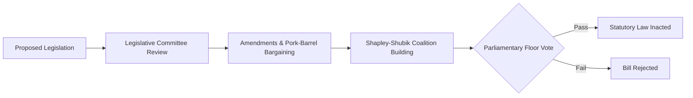

# 🗳️ Politic Sim — State-Level Legislative State Machine & Electoral Bayesian Filter

A deterministic political ecosystem simulator modeling legislative bill passage, coalition formation via Shapley-Shubik voting power indices, and Bayesian polling update filters across multi-party parliaments.

---

## 🏛️ Legislative State Machine

---

## 🔬 Core Capabilities

1. **Shapley-Shubik Voting Power:** Mathematical computation of pivotal party leverage in fragmented multi-party parliaments.
2. **Bayesian Polling Updates:** Real-time belief updating of voter preference distributions following economic shocks.
3. **Ideological Compass Space:** 2D spatial voting models (Economic Left/Right vs Authoritarian/Libertarian).

---

### 👨‍💻 Engineering Syndicate & Authors
- **Жирняк (Jirnyak)** — Lead Political Scientist & Game Theory Engine.  
  GitHub: [@Jirnyak](https://github.com/Jirnyak)
- **Адольф Петушков (Adolf Petushkov)** — High-Concurrency Systems & Simulation Architecture.  
  GitHub: [@marko1olo](https://github.com/marko1olo)
